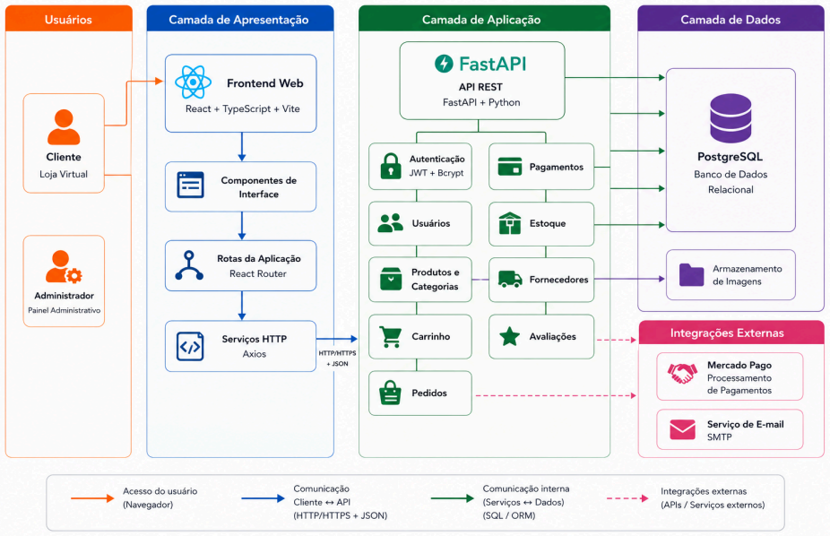
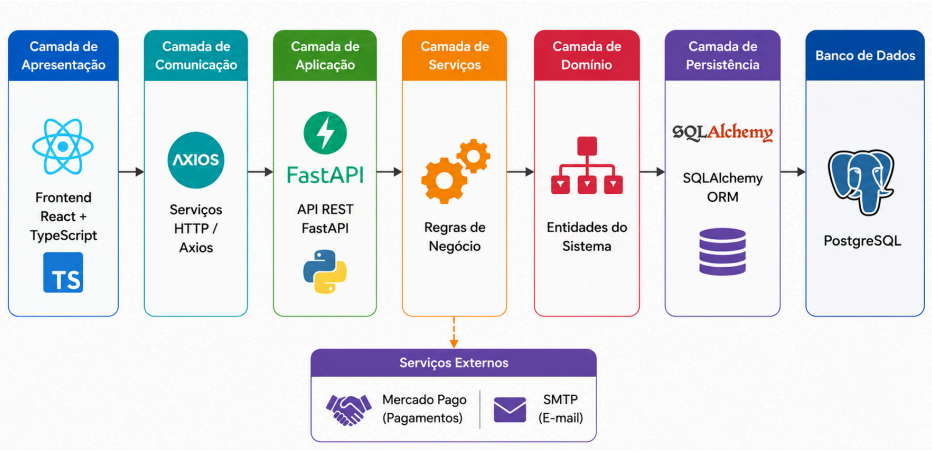
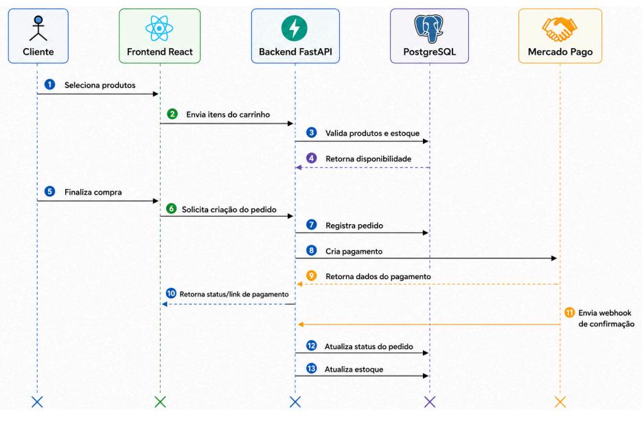
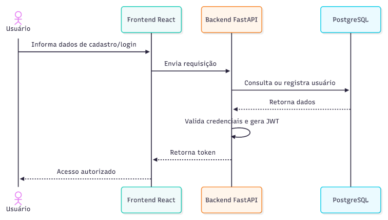
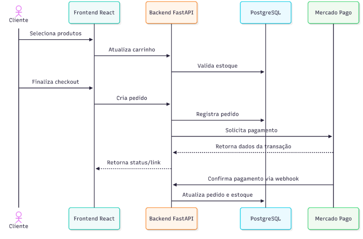
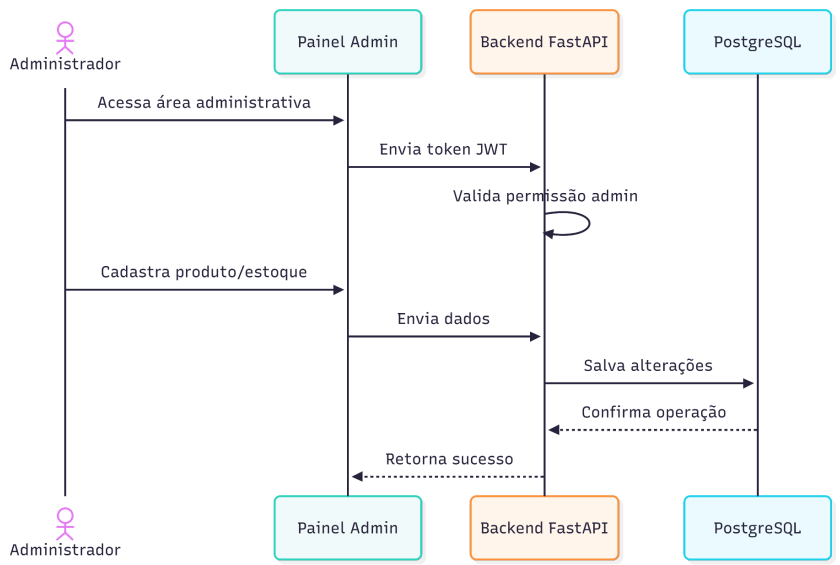

# Arquitetura do Sistema

A plataforma Toque de Mulher utiliza uma arquitetura desacoplada entre frontend, backend, banco de dados e integrações externas.

Essa separação busca facilitar a manutenção, a evolução da aplicação, a reutilização de componentes e a distribuição das responsabilidades entre os módulos do sistema.

## Visão geral da arquitetura

A arquitetura lógica apresenta a comunicação entre os principais usuários, a interface da aplicação, os serviços do backend, a camada de dados e os serviços externos utilizados pelo sistema.

Os principais componentes representados são:

- cliente da loja virtual;
- administrador;
- frontend web;
- componentes de interface;
- rotas da aplicação;
- serviços HTTP;
- API FastAPI;
- autenticação;
- usuários;
- produtos e categorias;
- carrinho;
- pedidos;
- pagamentos;
- estoque;
- fornecedores;
- avaliações;
- PostgreSQL;
- armazenamento de imagens;
- Mercado Pago;
- serviço de e-mail.

## Camadas da aplicação

A aplicação foi organizada em camadas para separar responsabilidades e reduzir o acoplamento entre os componentes.

| Camada | Tecnologia ou componente | Responsabilidade |
|---|---|---|
| Apresentação | React e TypeScript | Exibir a interface e receber as interações do usuário |
| Comunicação | Axios | Realizar requisições HTTP entre frontend e backend |
| Aplicação | FastAPI | Receber as requisições e disponibilizar os endpoints da API |
| Serviços | Regras de negócio | Processar operações e aplicar regras do sistema |
| Domínio | Entidades do sistema | Representar os principais objetos e conceitos da aplicação |
| Persistência | SQLAlchemy | Realizar o mapeamento entre objetos e tabelas |
| Banco de dados | PostgreSQL | Armazenar os dados persistentes |
| Serviços externos | Mercado Pago e SMTP | Processar pagamentos e enviar e-mails |

## Frontend

O frontend é responsável pela interação entre os usuários e a plataforma.

A aplicação utiliza:

- React;
- TypeScript;
- Vite;
- React Router;
- Axios;
- componentes reutilizáveis;
- serviços HTTP centralizados;
- páginas públicas;
- área administrativa;
- controle de sessão.

Entre as principais responsabilidades do frontend estão:

- apresentar o catálogo;
- receber dados dos formulários;
- manter a navegação;
- gerenciar o carrinho;
- iniciar o checkout;
- enviar requisições para o backend;
- exibir mensagens de sucesso e erro;
- controlar o acesso às páginas protegidas.

## Backend

O backend é responsável pelo processamento das requisições e pela aplicação das regras de negócio.

A API utiliza FastAPI e possui funcionalidades relacionadas a:

- autenticação;
- usuários;
- endereços;
- produtos;
- categorias;
- fornecedores;
- estoque;
- pedidos;
- pagamentos;
- avaliações;
- associação entre fornecedores e produtos.

O backend também realiza a comunicação com o banco de dados e com serviços externos.

## Banco de dados

O PostgreSQL é utilizado para armazenar as informações persistentes da plataforma.

Entre os principais dados armazenados estão:

- usuários;
- endereços;
- produtos;
- categorias;
- pedidos;
- itens dos pedidos;
- pagamentos;
- avaliações;
- estoque;
- fornecedores.

A comunicação com o banco utiliza SQLAlchemy ou SQLModel, permitindo o mapeamento das entidades do sistema para tabelas relacionais.

## Integrações externas

A arquitetura contempla integrações com serviços externos.

### Mercado Pago

O Mercado Pago é utilizado para:

- criar transações;
- processar pagamentos;
- retornar dados da operação;
- enviar confirmações por webhook;
- permitir a atualização do status do pedido.

### Serviço de e-mail

O serviço SMTP pode ser utilizado para envio de:

- confirmações;
- notificações;
- recuperação de acesso;
- informações sobre pedidos.

## Fluxo de comunicação

O fluxo geral da aplicação ocorre da seguinte forma:

1. O usuário realiza uma ação no frontend.
2. O frontend envia uma requisição HTTP para a API.
3. O backend valida os dados recebidos.
4. As regras de negócio são executadas.
5. O backend consulta ou altera dados no PostgreSQL.
6. Quando necessário, o backend se comunica com serviços externos.
7. A API retorna uma resposta ao frontend.
8. A interface apresenta o resultado ao usuário.

## Fluxo de checkout

O fluxo de checkout conecta o cliente, o frontend, o backend, o banco de dados e o serviço de pagamento.

O processo representado envolve:

1. seleção dos produtos;
2. envio dos itens do carrinho;
3. validação dos produtos e do estoque;
4. retorno da disponibilidade;
5. finalização da compra;
6. solicitação de criação do pedido;
7. registro do pedido;
8. criação do pagamento;
9. retorno dos dados da transação;
10. apresentação do link ou status do pagamento;
11. recebimento do webhook de confirmação;
12. atualização do pedido;
13. atualização do estoque.

## Fluxo de cadastro e login

O fluxo de autenticação ocorre da seguinte maneira:

1. o usuário informa os dados de cadastro ou login;
2. o frontend envia uma requisição ao backend;
3. o backend consulta ou registra o usuário;
4. o banco de dados retorna as informações;
5. as credenciais são validadas;
6. o backend gera um token JWT;
7. o token é retornado ao frontend;
8. o acesso do usuário é autorizado.

## Fluxo de compra

O fluxo inclui:

1. seleção dos produtos;
2. atualização do carrinho;
3. validação do estoque;
4. finalização do checkout;
5. criação e registro do pedido;
6. solicitação do pagamento;
7. retorno dos dados da transação;
8. confirmação do pagamento por webhook;
9. atualização do pedido;
10. atualização do estoque.

## Fluxo administrativo

O fluxo administrativo envolve:

1. acesso do administrador ao painel;
2. envio do token JWT;
3. validação da permissão administrativa;
4. cadastro ou alteração de produtos e estoque;
5. envio dos dados ao backend;
6. persistência das alterações no PostgreSQL;
7. confirmação da operação;
8. retorno de sucesso ao painel.

## Segurança

A arquitetura utiliza autenticação baseada em token JWT.

As principais responsabilidades de segurança incluem:

- proteção de credenciais;
- uso de hash para senhas;
- validação de tokens;
- proteção das rotas;
- diferenciação entre usuários comuns e administradores;
- validação das informações recebidas;
- proteção dos dados sensíveis.

## Divergência entre planejamento e implementação

Os documentos iniciais de planejamento indicavam React e Node.js como direção tecnológica.

A implementação versionada utiliza:

- React e TypeScript no frontend;
- FastAPI e Python no backend;
- PostgreSQL no banco de dados.

Essa divergência deve permanecer registrada para garantir rastreabilidade entre o planejamento e as decisões técnicas tomadas durante o desenvolvimento.

## Situação atual

A arquitetura representa a direção técnica do sistema.

Entretanto, a presença de um componente ou fluxo no diagrama não significa que ele esteja completamente validado em funcionamento.

Os fluxos de registro, login e consulta do usuário autenticado possuem implementação no frontend e no backend legado, mas precisam de revalidação de contrato porque as respostas atuais não batem totalmente com os tipos esperados pelo frontend.

Outros fluxos, como catálogo conectado à API, endereço, produto administrativo, pedido, pagamento, webhook e baixa automática de estoque, ainda precisam de validação completa de ponta a ponta.

Para mais informações, consulte [Status Atual da Implementação](../introducao/status_atual.md).
