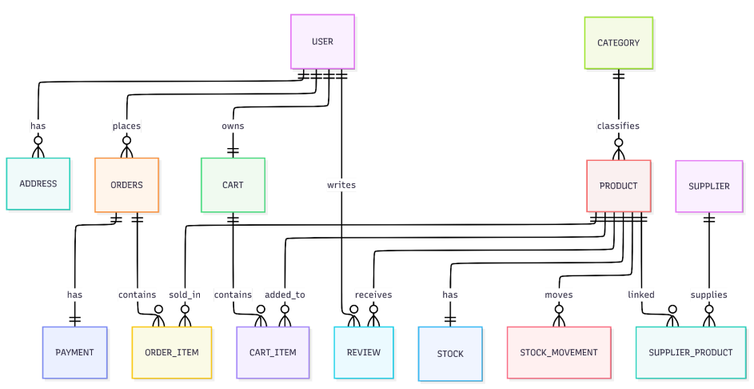

# Modelo de Dados

A plataforma Toque de Mulher utiliza um banco de dados relacional baseado em PostgreSQL.

O modelo foi estruturado para armazenar dados de usuários, produtos, categorias, pedidos, pagamentos, avaliações, estoque e fornecedores.

## Principais entidades

### Usuário

Armazena informações relacionadas aos usuários cadastrados, incluindo:

- dados pessoais;
- credenciais;
- informações de perfil;
- permissões;
- relacionamento com pedidos e endereços.

### Produto

Representa os produtos disponíveis no catálogo.

Pode armazenar:

- nome;
- descrição;
- preço;
- categoria;
- imagem;
- disponibilidade;
- informações de estoque.

### Categoria

Organiza os produtos em grupos para facilitar navegação e filtragem.

Uma categoria pode possuir vários produtos.

### Pedido

Registra uma compra realizada por um usuário.

Pode possuir:

- usuário responsável;
- itens;
- valor total;
- endereço;
- status;
- informações de pagamento.

### Item do pedido

Representa cada produto incluído em um pedido.

Pode registrar:

- produto;
- quantidade;
- preço unitário;
- subtotal.

### Pagamento

Armazena informações relacionadas ao processamento financeiro do pedido.

Pode incluir:

- identificador da transação;
- método de pagamento;
- valor;
- status;
- data de processamento.

### Avaliação

Registra avaliações e comentários feitos por usuários sobre produtos.

### Estoque

Controla a quantidade disponível de cada produto e suas movimentações.

### Fornecedor

Armazena informações das empresas ou pessoas responsáveis pelo fornecimento dos produtos.

### Associação fornecedor-produto

Representa o relacionamento entre fornecedores e produtos.

## Relacionamentos principais

- um usuário pode realizar vários pedidos;
- um usuário pode possuir vários endereços;
- um pedido pode conter vários itens;
- cada item de pedido está associado a um produto;
- uma categoria pode agrupar vários produtos;
- um produto pode receber várias avaliações;
- um produto pode possuir movimentações de estoque;
- um fornecedor pode fornecer vários produtos;
- um produto pode possuir mais de um fornecedor;
- um pedido pode possuir um pagamento associado.

## Persistência

O backend utiliza SQLAlchemy ou SQLModel para representar entidades e relacionamentos.

Essa abordagem permite:

- abstrair consultas SQL;
- organizar os modelos da aplicação;
- facilitar relacionamentos;
- aplicar validações;
- manter maior consistência entre código e banco.

