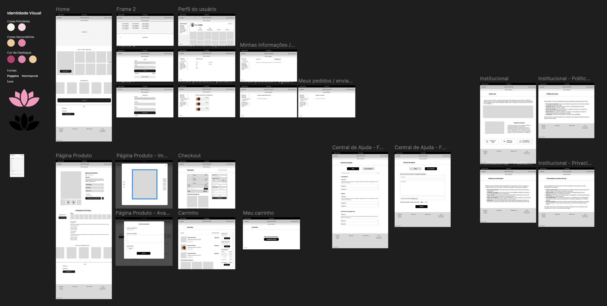
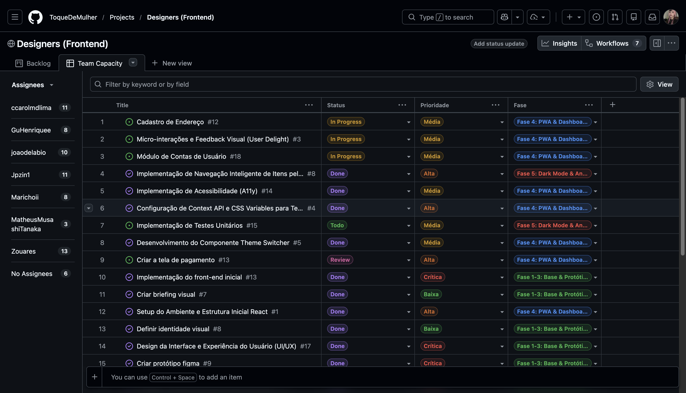
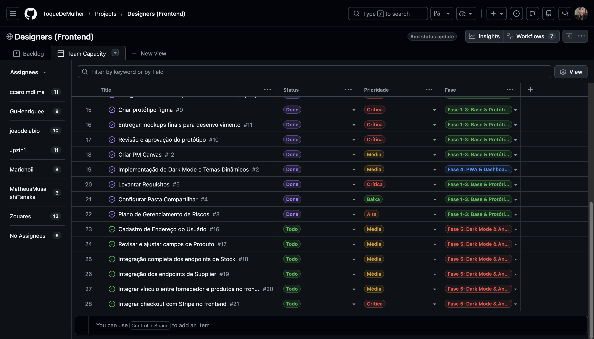
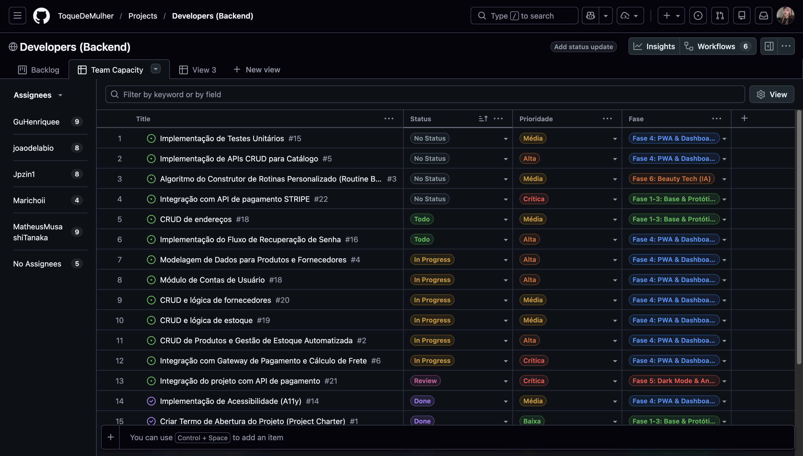
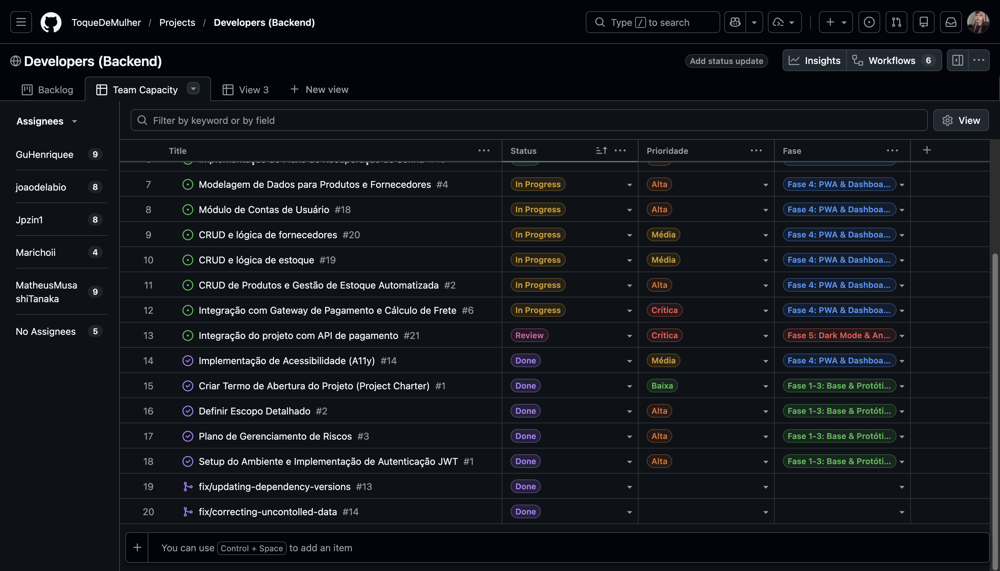
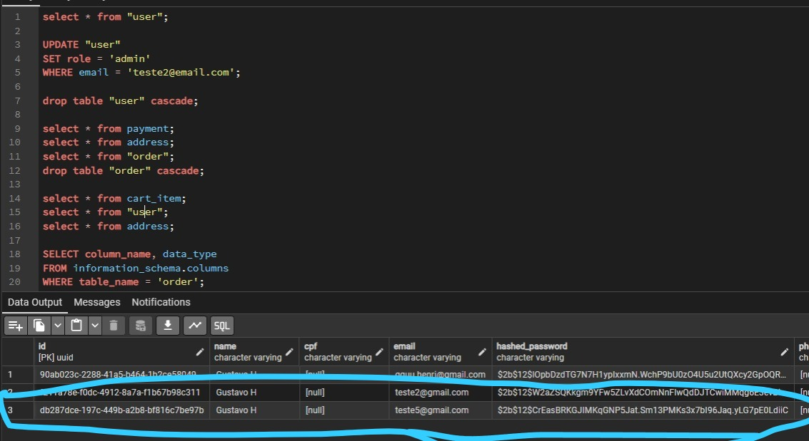
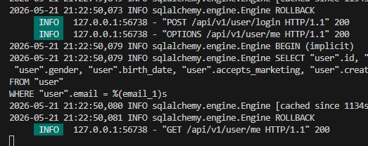

# Protótipo e Evidências Visuais

Este documento registra o mockup de alta fidelidade, prints de evidência e vídeo de demonstração usados como referência visual do projeto Toque de Mulher.

## Mockup de alta fidelidade

## Vídeo de demonstração

O vídeo não listado com as imagens do site está disponível em:

- [Demonstração do site no YouTube](https://youtu.be/bMFOPJKa_tY)

Esse link deve ser usado como evidência visual da navegação e do estado atual da interface.

## Prints anexados

| Asset                           | Tipo de evidência          | Observação                                     |
| ------------------------------- | --------------------------- | ------------------------------------------------ |
| `figma_altafidelidade.png`    | Mockup de alta fidelidade   | Referência visual do Figma/protótipo           |
| `githubproject_frontend.png`  | Evidência de organização | Print do projeto/repositório frontend           |
| `githubproject_frontend2.png` | Evidência de organização | Segundo print do projeto/repositório frontend   |
| `githubproject_backend.png`   | Evidência de organização | Print do projeto/repositório backend            |
| `githubproject_backend2.png`  | Evidência de organização | Segundo print do projeto/repositório backend    |
| `integracao_backend.jpeg`     | Evidência técnica         | Print de integração/execução backend         |
| `integracao_backend2.jpeg`    | Evidência técnica         | Segundo print de integração/execução backend |

### Evidências de organização do frontend

### Evidências de organização do backend

### Evidências de integração backend

## Mudanças em relação ao mockup

As principais mudanças feitas no site em relação ao mockup de alta fidelidade foram:

| Item | Antes/no mockup | Implementado no site | Motivo |
|---|---|---|---|
| Cores predominantes | Rosa como cor mais forte da identidade visual | Preto passou a ser a cor predominante | Solicitação da cliente |
| Tipografia | `Inter` | `All Round Gothic` e `Noto Sans` | Ajuste visual para aproximar a interface da identidade desejada |
| Experiência de produto | Fluxo visual principal de catálogo e compra | Adição de gamificação de produtos, com páginas de missões e ranking | Melhorar engajamento e diferenciação da experiência |
| Estrutura geral | Layout do mockup de alta fidelidade | Mantida sem mudanças relevantes | Preservar a proposta aprovada |

Fora essas alterações, a estrutura geral do site permaneceu alinhada ao mockup.

## Uso na documentação

Os assets em `docs/assets` e o vídeo não listado no YouTube passam a ser as evidências visuais principais para a evolução da interface e para a validação técnica da Sprint #06. Eles devem ser usados junto com os registros de sprint para demonstrar a direção visual do produto, a organização dos repositórios e os registros de integração.

## Observações

- O mockup de alta fidelidade está em `PNG`, com resolução de `2678 x 1350`.
- As imagens de projetos GitHub registram a organização do frontend e backend.
- As imagens de integração backend registram evidências técnicas de funcionamento/validação.
- A documentação de sprints deve citar estes assets quando houver entrega ou validação relacionada ao frontend, backend ou integração.
- Mudanças relevantes no protótipo, nos prints ou no vídeo devem ser registradas neste documento.
